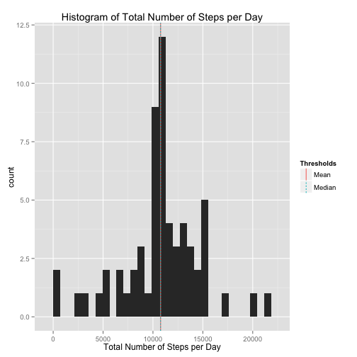

This document can be converted to HTML through Knit HTML in RStudio. 

It can also be converted through R interpreter in console. That requires following commands to be run

```r
require(knitr)
require(markdown)
knit2html("PA1_template.Rmd")
```

## Loading and preprocessing the data

1. Load the data (i.e. read.csv())

Define a function to read a zip file.
Call the function on "activity.zip". The assumption is that "activity.zip" is present in current working directory.

idata contains unprocessed data.


```r
readData <- function(file) {
zipFileInfo <- unzip(file, list=TRUE)
if(nrow(zipFileInfo) > 1)
  stop("More than one data file inside zip")
else
  read.csv(unz(file, as.character(zipFileInfo$Name)), head=TRUE)
}

idata<-readData("activity.zip")
```


2. Process/transform the data (if necessary) into a format suitable for your analysis

Load the ggplot2 and dplyr libraries. 
Process data to add other variables:

* hour: Hour of day (0-23)
* startint: Interval start within hour (0-55 in steps of 5)
* hrindex: Index of interval within hour (1-12)
* dayindex: Index of interval within day (1-288)


```r
library(ggplot2)
```

```
## Warning: package 'ggplot2' was built under R version 3.1.3
```

```r
library(dplyr)
```

```
## 
## Attaching package: 'dplyr'
## 
## The following object is masked from 'package:stats':
## 
##     filter
## 
## The following objects are masked from 'package:base':
## 
##     intersect, setdiff, setequal, union
```

```r
pdata <-idata
pdata$hour <- pdata$interval %/% 100
pdata$startint <- pdata$interval %% 100
pdata$hrindex <- (pdata$startint / 5) + 1 
pdata$dayindex <- pdata$hrindex + (pdata$hour * 12)
ddata <- tbl_df(pdata)

gdata <- group_by(ddata, date)
```


## What is mean total number of steps taken per day?

1. Calculate the total number of steps taken per day


```r
tdata <- summarize(gdata, mean_step_day = mean(steps, na.rm = TRUE), total_step_day = sum(steps, na.rm = TRUE))
tdata[1:61,]
```

```
## Source: local data frame [61 x 3]
## 
##          date mean_step_day total_step_day
## 1  2012-10-01           NaN              0
## 2  2012-10-02       0.43750            126
## 3  2012-10-03      39.41667          11352
## 4  2012-10-04      42.06944          12116
## 5  2012-10-05      46.15972          13294
## 6  2012-10-06      53.54167          15420
## 7  2012-10-07      38.24653          11015
## 8  2012-10-08           NaN              0
## 9  2012-10-09      44.48264          12811
## 10 2012-10-10      34.37500           9900
## ..        ...           ...            ...
```

3. Calculate and report mean and median of the total number of steps taken per day. Note that the hostogram is drawn later as I wanted to plot mean and median on it.


```r
mean_steps <- mean(tdata$total_step_day)
median_steps <- median(tdata$total_step_day)
```
Mean of total number of steps per day is 9354.2295082.

Median of total number of steps per day is 10395.

2. Make a histogram of the total number of steps taken each day


```r
thres1 <- data.frame(Thresholds="Mean", vals = mean(tdata$total_step_day))
thres2 <- data.frame(Thresholds="Median", vals = median(tdata$total_step_day))
thres <- rbind(thres1,thres2)
thres
```

```
##   Thresholds     vals
## 1       Mean  9354.23
## 2     Median 10395.00
```

```r
p <- ggplot(data=tdata, aes(tdata$total_step_day)) + 
     geom_histogram() + 
     geom_vline(data=thres, aes(xintercept=vals, linetype=Thresholds, color=Thresholds), show_guide=TRUE) + 
     xlab("Total Number of Steps per Day") +
     ggtitle("Histogram of Total Number of Steps per Day") 
p    
```

 


## What is the average daily activity pattern?

1. Make a time series plot (i.e. type = "l") of the 5-minute interval (x-axis) and the average number of steps taken, averaged across all days (y-axis)

Here, I wanted to try something different. So I converted the interval to an index from 1-288, i.e., each day has 288 intervals. It is straight forward to maintain the intervals provided in the data. I use that in the last plots.


```r
da <- group_by(ddata, dayindex)
dadata <- summarize(da, mean_step_interval = mean(steps, na.rm = TRUE), 
                    total_step_interval = sum(steps, na.rm = TRUE))
p1 <- ggplot(data=dadata, aes(x=dadata$dayindex, y = dadata$mean_step_interval)) +
      geom_line() +
      xlab("Interval (1-288)") +
      ylab("Mean Number of Steps") + 
      ggtitle("Mean Number of Steps per Interval")

p1
```

 

2. Which 5-minute interval, on average across all the days in the dataset, contains the maximum number of steps?


```r
max_interval_indx = which.max(dadata$mean_step_interval)
max_interval = da[dadata$dayindex == max_interval_indx, 3]
mi <- max_interval[1,]
```

The 5-min interval, on average across all the days, containing max steps steps is 835.

## Imputing missing values

1. Calculate and report the total number of missing values in the dataset (i.e. the total number of rows with NAs)


```r
incomplete_rows <- sum(!complete.cases(idata))
```

The total number of rows containing NAs is 2304.

2. Devise a strategy for filling in all of the missing values in the dataset. The strategy does not need to be sophisticated. For example, you could use the mean/median for that day, or the mean for that 5-minute interval, etc.

The strategy I use is to fill NA with the mean number of steps for that interval across all days.


3. Create a new dataset that is equal to the original dataset but with the missing data filled in.

imputed is the data containing missing values filled in using the strategy described above.


```r
imputed <- idata
t<-nrow(imputed)
for (i in 1:t) {
    k <- i %% 288
    if (k == 0) {
        k <- 288
    }
    if (is.na(imputed$steps[i])) {
        prow <- imputed[i,]
        imputed[i, 1] = as.integer(round(dadata$mean_step_interval[k]))
    } 
}
```


```r
imputed_data <- tbl_df(imputed)

head(imputed_data)
```

```
## Source: local data frame [6 x 3]
## 
##   steps       date interval
## 1     2 2012-10-01        0
## 2     0 2012-10-01        5
## 3     0 2012-10-01       10
## 4     0 2012-10-01       15
## 5     0 2012-10-01       20
## 6     2 2012-10-01       25
```

```r
grouped_imputed_data <- group_by(imputed_data, date)
daily_grouped_imputed_data <- summarize(grouped_imputed_data, 
                                        mean_step_day = mean(steps, na.rm = TRUE), 
                                        total_step_day = sum(steps, na.rm = TRUE))
```

3. Make a histogram of the total number of steps taken each day and Calculate and report the mean and median total number of steps taken per day. Do these values differ from the estimates from the first part of the assignment? What is the impact of imputing missing data on the estimates of the total daily number of steps?


```r
new_mean_steps <- mean(daily_grouped_imputed_data$total_step_day)
new_median_steps <- median(daily_grouped_imputed_data$total_step_day)

diff_mean_steps = abs(new_mean_steps - mean_steps) 
diff_median_steps = abs(new_median_steps - median_steps)
ans = ifelse(diff_mean_steps != 0 | diff_median_steps != 0, "Yes", "No")
thres3 <- data.frame(Thresholds="Mean", vals = mean(daily_grouped_imputed_data$total_step_day))
thres4 <- data.frame(Thresholds="Median", vals = median(daily_grouped_imputed_data$total_step_day))
thres5 <- rbind(thres3,thres4)
thres5
```

```
##   Thresholds     vals
## 1       Mean 10765.64
## 2     Median 10762.00
```

```r
p <- ggplot(data=daily_grouped_imputed_data, aes(daily_grouped_imputed_data$total_step_day)) + 
     geom_histogram() + 
     geom_vline(data=thres5, aes(xintercept=vals, linetype=Thresholds, color=Thresholds), show_guide=TRUE) +
     xlab("Total Number of Steps per Day") + 
     ggtitle("Histogram of Total Number of Steps per Day")

p    
```

 

Q: Do these values differ from the estimates from the first part of the assignment? 

A: Yes

New mean is: 1.0765639 &times; 10<sup>4</sup>.

The difference in Mean is: 1411.4098361.

New median is: 10762.

The difference in Median is: 367.

## Are there differences in activity patterns between weekdays and weekends?

1. Create a new factor variable in the dataset with two levels – “weekday” and “weekend” indicating whether a given date is a weekday or weekend day.


```r
imputed_data_day <- mutate(imputed_data, day = weekdays(as.Date(date)))
imputed_data_day_wd <- mutate(imputed_data_day, 
                              wd = ifelse(day == "Saturday"| day == "Sunday", "Weekend", "Weekday"))
imputed_data_day_wd$wd <- factor(imputed_data_day_wd$wd)
```

2. Make a panel plot containing a time series plot (i.e. type = "l") of the 5-minute interval (x-axis) and the average number of steps taken, averaged across all weekday days or weekend days (y-axis). 


```r
imputed_data_day_wd_hrindex <- mutate(imputed_data_day_wd, hrindex = ((interval %% 100)/5)+1)
imputed_data_day_wd_hrindex_summarized <- imputed_data_day_wd_hrindex %>% group_by(wd, interval) %>% summarize(avgSteps = mean(steps))

q <- ggplot(data=imputed_data_day_wd_hrindex_summarized, aes(interval, avgSteps)) + 
     geom_line() + 
     facet_grid(wd ~ .) +
     ylab("Avg Number of Steps") +
     xlab("Interval (24-hours)") +
     ggtitle("Avg Number of Steps per Interval (Weekday vs Weekend)")
      
q    
```

 
